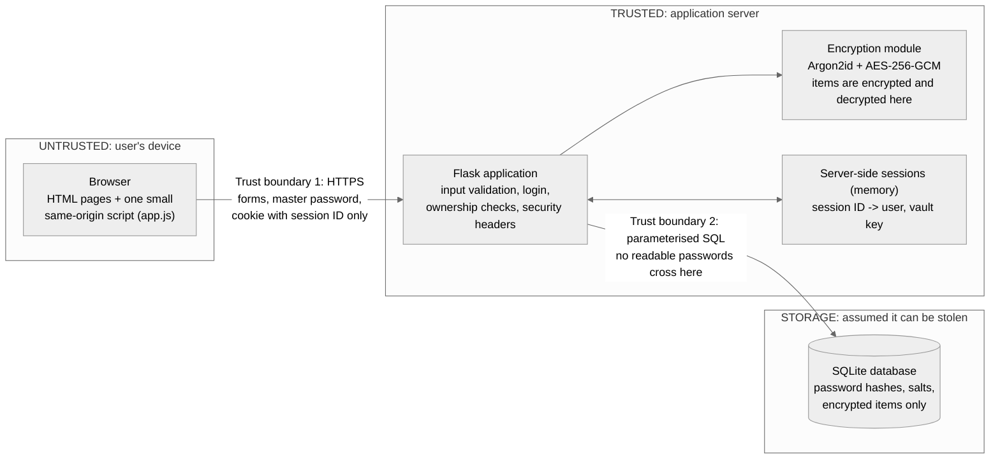
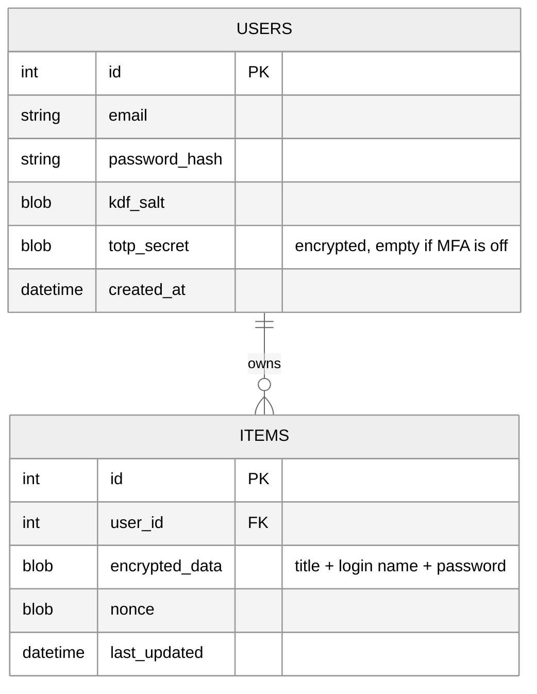

# Secure Password Manager

Repository: https://github.com/sebasp-9/ics0027

ICS0027 Web Application Security, Checkpoint 1. Sebastian Parra Pinto (255940IVSB)

## 1. Scope

The Secure Password Manager is a web application where a user stores the logins they use on other websites. A user signs up with an email and a master password, and can then create, view, edit and delete items. Each item is one saved login with a title, a login name and a password, and it is encrypted before it is saved. Two-factor authentication with TOTP codes is an optional feature.

Folders, password history, sharing, a browser extension and account recovery are out of scope. A forgotten master password cannot be recovered, because the encryption key is derived from it and no other copy of it exists.

The pages are HTML generated by Python. A small JavaScript file adds a show/hide button for password fields and a copy button.

## 2. System architecture

**Trust boundary 1 (browser to server).** Everything the browser sends can be changed with tools such as Burp Suite, so the server checks all input again and takes the user's identity only from the session.

**Trust boundary 2 (server to database).** The database is treated as something that could be stolen, so it only receives data that is useless without the master password.

**Where encryption happens.** Items are encrypted and decrypted only on the server, in the encryption module. The connection between browser and server is protected by HTTPS.

## 3. Cryptographic design

**Key derivation.** The master password is processed twice with Argon2id, a slow password hashing function that makes guessing expensive:

1. With its own random salt it produces `password_hash`, which is stored and used to check the login.
2. With a second random salt, `kdf_salt`, it produces the 256-bit **vault key**. The vault key is never stored in the database. After login it is kept only in the server-side session and is deleted at logout.

The two salts are different so that the stored hash is not the same as the vault key. Otherwise, a stolen database would contain the key.

**Encryption.** The title, login name and password of each item are encrypted together with AES-256-GCM, using a new random nonce every time. AES-GCM also detects if the encrypted data has been changed. The TOTP secret is encrypted in the same way if MFA is turned on.

**What the database stores.**

A stolen copy of the database shows the email addresses and how many items each user has, but no titles, login names or passwords.

## 4. Threat model

| # | Threat | OWASP 2025 / Week | Planned mitigation |
|---|---|---|---|
| T1 | Stored XSS and HTML injection, e.g. a script saved in an item title | A05 Injection, W3 and W4 | Jinja2 escapes all output automatically. The Content Security Policy blocks inline scripts. |
| T2 | JavaScript injection through our own script | A05, W4 | The script uses only `textContent`, never `innerHTML` or `eval`. Only scripts from our own site may run. |
| T3 | IDOR: changing the item ID in the URL | A01 Broken Access Control, W3 | Every database query checks that the item belongs to the logged-in user. |
| T4 | Tampering with form fields, hidden fields or headers | A01, W3 | The user is always taken from the session, never from the request. Forms accept only their own fields. |
| T5 | Bypassing browser checks such as `maxlength` | A06 Insecure Design, W3 | Every check is repeated on the server. Input that the browser should have blocked is logged. |
| T6 | Stolen or changed database | A04 Cryptographic Failures | Only hashes, salts and encrypted items are stored. AES-GCM detects changed data. |
| T7 | Guessing master passwords | A07 Authentication Failures | Rate limiting on login, Argon2id, the same error message for every failed login, optional TOTP. |
| T8 | Session hijacking through XSS | A07, W4 | `HttpOnly` cookie and a short session lifetime. |
| T9 | Session fixation | A07 | A new session ID is created at every login. |
| T10 | CSRF | A01, W2 | CSRF token in every form and `SameSite=Strict` cookie. |
| T11 | Eavesdropping on the network | A04, W2 | HTTPS only and the `Secure` cookie flag. |
| T12 | SQL injection | A05 | SQLAlchemy with parameterised queries only. |
| T13 | Leaked secret key | A02 Security Misconfiguration, W3 | The secret key is kept in a `.env` file that is never committed to Git. |

A remaining risk is an attacker who takes control of the running server, because they could read the vault keys of logged-in users. Short sessions limit this.

## 5. Authentication and session model

**Login.** The user enters email and master password. The server checks the password, derives the vault key, deletes the old session and creates a new one. The vault key stays on the server, and the browser only receives a random session ID in a cookie.

**Cookie flags.**

- `Secure`: the cookie is only sent over HTTPS.
- `HttpOnly`: JavaScript cannot read the cookie.
- `SameSite=Strict`: the cookie is not sent when another website starts the request.

**Expiry.** A session ends after 15 minutes of inactivity or after 8 hours in total. Logout deletes the session on the server, together with the vault key.

**Fixation prevention.** A new session ID is created at every login, so a session ID that an attacker set before the login is useless afterwards.

**Optional MFA.** A user can turn on TOTP codes from an authenticator app. After the correct password, the user must also enter the 6-digit code before getting access, and a new session ID is created again.

## 6. Technology and TLS

The application uses Python with Flask, SQLite with SQLAlchemy, argon2-cffi for Argon2id, and the `cryptography` library for AES-GCM. During development it runs over HTTPS with a local certificate made with `mkcert`.
